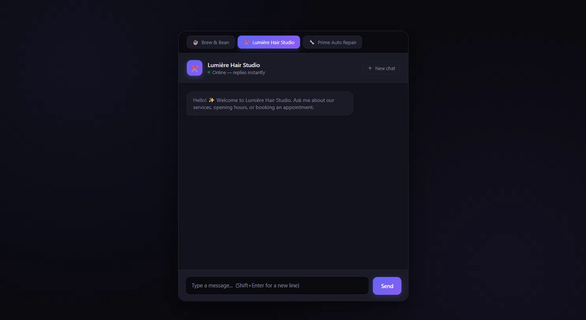

# AI Customer Assistant — Multi-Business Demo

A production-style AI chatbot for small businesses, built with Node.js and the Anthropic Claude API. It answers customer questions through a clean, dark-themed chat interface with streaming responses — and can switch between completely different businesses (a coffee shop, a hair salon, an auto repair shop) at the click of a button.

This project demonstrates a complete, reusable pattern for adding an AI assistant to any business website: the same codebase serves any business — only the assistant's instructions change. The built-in business switcher shows this off directly.

## Live Demo

**[Try it live →](https://ai-chatbot-vy0m.onrender.com)**



> _Note: the live demo runs on a free instance that sleeps after inactivity, so the first request may take up to ~50 seconds to wake it._

## Features

- **Multi-business switcher** — one system serves three different businesses (coffee shop, hair salon, auto repair). Switching updates the assistant's personality, name, avatar, and knowledge instantly. This is the core idea: same code, different business.
- **Streaming responses** — replies appear progressively as they're generated, like ChatGPT or Claude.ai, instead of all at once.
- **Conversational memory** — the assistant remembers earlier messages within a session and answers follow-up questions in context.
- **Stays factual, never invents** — when asked about something it wasn't given (for example an exact price), it admits it doesn't know and points the customer to a phone number instead of guessing. This is the behaviour businesses need most from a customer-facing bot.
- **Markdown formatting** — bot replies render bold text, lists, and links properly.
- **Polished chat UX** — typing indicator, smooth animations, copy-to-clipboard on replies, "new chat" button, multi-line input (Shift+Enter), and a character counter.
- **Robust & safe** — rate limiting (per-IP), input validation (empty and over-long messages blocked on both client and server), and clear system notices for errors and connection issues.
- **Secure by design** — the API key lives in an environment variable on the server and is never exposed to the browser.

## Tech Stack

- **Backend:** Node.js, Express
- **AI:** Anthropic Claude API (`@anthropic-ai/sdk`) with streaming
- **Frontend:** vanilla HTML, CSS, and JavaScript (no framework), marked for markdown rendering
- **Protection:** express-rate-limit
- **Config:** dotenv for environment variables
- **Hosting:** Render

## How It Works

The app follows the standard pattern for AI applications:

1. The browser sends the conversation (plus which business is selected) to the backend.
2. The backend picks that business's system prompt and forwards the conversation to the Claude API, streaming the reply back.
3. The frontend displays the reply as it arrives and keeps the running conversation in memory.

Keeping the API call on the server (rather than in the browser) is what keeps the API key private — a browser app that shipped its key would leak it to every visitor.

Each business is defined in a separate `businesses.js` file (name, emoji, welcome message, and system prompt). The server exposes them through a `/businesses` endpoint, so the frontend builds the switcher from a single source of truth.

## Getting Started

### Prerequisites

- Node.js (v18 or newer)
- An Anthropic API key from [console.anthropic.com](https://console.anthropic.com)

### Installation

```bash
git clone https://github.com/tomasko-has/ai-chatbot.git
cd ai-chatbot
npm install
```

### Configuration

Create a `.env` file in the project root and add your API key:

```
ANTHROPIC_API_KEY=sk-ant-your-key-here
```

> The `.env` file is git-ignored and must never be committed.

### Run

```bash
node --watch index.js
```

Then open **http://localhost:3000** in your browser.

## Adding or Customising a Business

To add a new business or change an existing one, edit `businesses.js` only. Add a new entry with an `id`, `name`, `emoji`, `welcome` message, and `systemPrompt`. No other code changes are required — the switcher and the chat endpoint pick it up automatically. That's the whole point of the pattern.

## Project Structure

```
ai-chatbot/
├── index.js            # Express server + Claude API integration + streaming
├── businesses.js       # Business definitions (names, prompts) — edit this to add businesses
├── public/
│   └── index.html      # Chat interface (UI + client-side logic)
├── docs/
│   └── screenshot.png  # Interface screenshot for this README
├── .env                # API key (not committed)
├── .gitignore
├── package.json
└── README.md
```

## Notes

Conversations are held in memory for the duration of a session and are intentionally not persisted — this matches how most business website assistants work, where each visitor starts fresh. Switching businesses starts a new conversation. Persistence (a database and user accounts) can be added when a project specifically calls for it.

## License

MIT